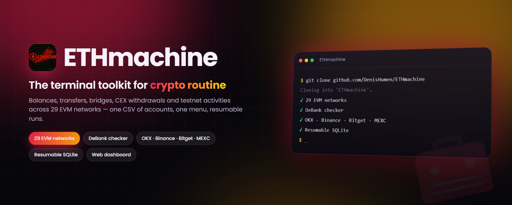

<div align="center">



# ETHmachine

**A terminal all-in-one for crypto routine: wallets, balances, transfers, exchanges and testnets — driven by one CSV and one menu.**

[](#-quick-start)
[](#-quick-start)
[](#-supported-networks)
[](LICENSE.txt)
[](https://github.com/DenisHumen/ETHmachine/commits/main)
[](https://t.me/DenisHumen)

**English** · [Русский](README.ru.md)

[Features](#-features) · [Quick start](#-quick-start) · [Configuration](#%EF%B8%8F-configuration) · [Usage](#-usage) · [Security](#-security)

</div>

---

ETHmachine is a console tool for people who run many wallets at once. One CSV file with your accounts, one menu — and from there you get balance checks, transfers, exchange withdrawals, testnet activities and a set of everyday utilities (wallet, password and nickname generators, proxy and mailbox checkers).

<div align="center">
  
</div>

The project is built on a few principles:

| | |
|---|---|
| 📄 **One data source** | All accounts live in `data/data.csv`. Modules do not read their own files or ask you to paste keys again. |
| ♻️ **Resumable** | Long operations write progress to SQLite. Interrupted at wallet 300 — the next run continues from 301, not from scratch. |
| 📊 **Reports from the database, not from logs** | Excel reports are always built from the DB, so they stay correct after a crash. |
| 🧵 **Multithreaded by default** | The thread count is set once in `config/modules/general_config.py` and applies to all modules. |
| 🧦 **A proxy per account** | Every data row has its own proxy and a reserve proxy. |

> [!NOTE]
> The terminal interface, logs and module docs in `docs/` are in **Russian**. Menu item names are quoted below exactly as they appear in the app.

## ✨ Features

### 💰 Balances

| Menu item | What it does |
|---|---|
| **EVM-сети** (EVM networks) | Native token balance in any of the 29 EVM networks, plus ERC-20 balances for tokens listed in `config/token_address_erc20.py` |
| **Solana** / **Eclipse** | Native balances |
| **DeBank Checker** | All tokens across all chains at once (DeBank API interception in a browser). The balance excludes junk airdrops and is reconciled with DeBank's own estimate; thresholds live in `config/modules/cfg_debank.py` |
| **DeBank Protocols** | DeFi positions: staking, lending, LP, locked |
| **zkSync Lite** | Balance checker for lite.zksync.io with Excel export, plus *Swap to Era* and *DAI Withdraw → L1* |

### 🚀 Transactions

| Menu item | What it does |
|---|---|
| **Collectors** | Sweep balances from all wallets to your main wallet (`EVM_MAIN_WALLET`) |
| **Перевод нативных токенов** (native token transfer) | Wallet-to-wallet transfers, by amount or by share of the balance |
| **Перевод ERC-20** (ERC-20 transfer) | The same for tokens |
| **KAVA → биржа** (KAVA → exchange) | Native KAVA to a CEX via the Cosmos SDK (`kava1…` → `0x…`) |
| **Relay Bridge** | Cross-chain bridge via Relay Link, with progress stored in the DB |

### 🏦 Exchanges (CEX)

| Exchange | Withdraw | Balances | Sub-accounts | Spot |
|---|:---:|:---:|:---:|:---:|
| **OKX** | ✅ | ✅ | ✅ | ✅ |
| **Binance** | ✅ | ✅ | ✅ | — |
| **Bitget** | ✅ | — | ✅ | — |
| **MEXC** | ✅ | — | — | — |

Multiple accounts per exchange are configured in `config/cex_settings.py` — see [docs/MULTIPLE_EXCHANGE_ACCOUNTS.md](docs/MULTIPLE_EXCHANGE_ACCOUNTS.md).

### 🎮 Projects

| Menu item | What it does |
|---|---|
| **Dune Analytics** | Check wallets against Dune dashboards |
| **Fhenix** | ghostchain and Alchemy faucets (Sepolia) |
| **LiteForge Testnet** | zkLTC faucet, bridge, swaps, NFT mints, ZNS domains |
| **Sahara AI** | Knowledge Drop claim and withdrawal to an exchange |
| **SafePal X1** | Eligibility check for the hardware-wallet claim |
| **xStocks DeFi** | Registration, GM, referrals, points *(paused)* |
| **Neura** | Per-account statistics *(Windows only)* |

### 🐦 Twitter

Account validity checks (**Проверка аккаунтов**) and automated tasks — likes, reposts, comments (**Выполнение заданий**) — with progress saved in the DB.

### 🧰 Tools

| Menu item | What it does |
|---|---|
| **Генерация кошельков** (wallet generator) | EVM and Solana, including vanity addresses (Python or Rust) |
| **Конвертер ключей** (key converter) | Mnemonic ↔ private key ↔ address |
| **Генератор паролей** (password generator) | Cryptographically strong passwords by your rules |
| **Генератор никнеймов** (nickname generator) | Plausible nicknames for sign-ups |
| **Генератор имён** (name generator) | First and last names: RU / UA / ENG |
| **Проверка прокси** (proxy checker) | Availability, speed, geolocation, access to services |
| **Возраст Discord** (Discord age) | Account registration date from tokens |
| **Проверка почт** (mail checker) | Mailbox validation over IMAP |
| **Загрузка с Pinterest** (Pinterest downloader) | Random pictures for avatars |
| **Polygon zkEVM → Base** | Swap all tokens to USDC via Layerswap |
| **zkSync Era → Base** | Swap USDC/USDT to USDC via Rhino.fi |

### 💾 Backups

Local ZIP archives with rotation, SFTP upload and a live mode with encryption (Fernet + PBKDF2). Details: [docs/MODULE_AUTO_BACKUP.md](docs/MODULE_AUTO_BACKUP.md).

### 💻 Web panel

An optional local web panel (aiohttp): live logs, browsing the databases in `db/`, downloading reports and editing configs in the browser. See [Web dashboard](#-web-dashboard).

## 🚀 Quick start

You need **Python 3.10+** and **Git**.

```bash
git clone https://github.com/DenisHumen/ETHmachine
cd ETHmachine
python -m venv venv
```

Activate the environment:

```bash
venv\Scripts\activate          # Windows
source venv/bin/activate       # Linux / macOS
```

Install dependencies:

```bash
pip install -r requirements.txt
```

Browser-based modules (DeBank, Dune, xStocks, some testnets) need Chromium:

```bash
python -m playwright install chromium
```

Run:

```bash
python main.py
```

On first launch the program creates the `data/`, `db/`, `result/`, `log/` and `backups/` folders plus config templates. Fill in `data/data.csv` and you are ready to go.

> [!TIP]
> **Linux:** some packages need Python headers and a compiler: `sudo apt install -y python3-dev build-essential`.
>
> **Windows + Python 3.12 or newer:** the pinned `web3==6.13.0` pulls in `lru-dict<1.3.0`, which has no prebuilt wheels there, so pip will try to compile it and fail without the Microsoft C++ Build Tools (see the note in `requirements.txt`). Use Python 3.10/3.11 or install the Build Tools.

### Optional dependencies

Needed only for specific modules — everything else works without them.

| Module | Requires | Install |
|---|---|---|
| DeBank, Dune, xStocks | Chromium for Playwright | `python -m playwright install chromium` |
| LiteForge (Vercel bypass) | Patchright + Chromium | `pip install patchright && python -m patchright install chromium` (the package is already in `requirements.txt`) |
| zkSync Lite → Era | Node.js 18+ | `cd modules/zksync_lite/swap/node_helper && npm install` |
| Vanity addresses (Rust) | Cargo | [rustup.rs](https://rustup.rs) |

## ⚙️ Configuration

### Data: `data/data.csv`

All accounts live in one CSV. Fill in only the columns your tasks need — the rest can stay empty.

<details>
<summary><b>All columns</b></summary>

| Column | Meaning | Example |
|---|---|---|
| `name` | Account name for logs | `acc-01` |
| `private_key` | EVM private key | `0xabc…` |
| `proxy` | Main proxy | `user:pass@ip:port` |
| `reserve_proxy` | Reserve proxy | `user:pass@ip:port` |
| `wallet_address` | EVM address, if there is no key | `0x742d…` |
| `mnemonic` | Mnemonic (12/24 words) | `word1 word2 …` |
| `sol_address` | Solana address | `7xKXt…` |
| `sol_private_key` | Solana private key (base58) | `5J…` |
| `discord_token` | Discord token | `MTIx…` |
| `email` | Email | `user@mail.com` |
| `email_password` | Email password | `••••` |
| `email_imap` | IMAP server | `imap.mail.com` |
| `referral_code` | Referral code | `REF123` |
| `evm_cex_address` | EVM recipient address (e.g. exchange deposit) | `0x742d…` |
| `sol_cex_address` | Solana recipient address | `7xKXt…` |
| `transfer_amount` | Amount for the transfer modules | `0.1-0.2` or `90-100%` |

</details>

**`transfer_amount` format** — the two transfer modules read it differently:

| Value | Native token transfer | ERC-20 transfer |
|---|---|---|
| `0.1-0.2` (has a decimal point) | random amount of the native coin in that range | token amount |
| `90-100` (whole numbers, no `%`) | **percent** of the balance | **token amount** |
| `90-100%` | percent of the balance | percent of the token balance |
| `1-3token` | — | fixed token amount |

Surrounding quotes are ignored. Details for ERC-20 are in the header of `config/modules/cfg_transfer_erc20.py`.

#### Multiple profiles

Data files must be named `data.csv` or `data_<profile>.csv`. If `data/` holds several of them, the program asks which one to use at startup:

```text
data/data.csv        ← main
data/data_main.csv
data/data_farm.csv
```

Twitter accounts and tasks are stored separately, in `data/twitter/`.

### Settings: `config/`

Settings are split by file: shared ones in one place, module-specific ones next to the module name.

```text
config/
├── modules/
│   ├── general_config.py   ← threads, delays, retries, captcha, main wallets, web panel switch
│   ├── cfg_backup.py       ← local backups and SFTP
│   ├── cfg_cex.py          ← exchange withdrawal rules
│   ├── cfg_transfer.py     ← native token transfers
│   ├── cfg_transfer_erc20.py
│   ├── cfg_twitter.py
│   ├── cfg_password.py     ← password generator
│   ├── cfg_generators.py   ← nickname and name generators
│   ├── cfg_nice_address.py ← vanity address masks
│   └── …                   ← one file per module
├── cex_settings.py         ← exchange API keys (created on first run, not in git)
├── networks.py             ← RPC endpoints and network parameters
├── token_address_erc20.py  ← token addresses per network
└── menu_config.py          ← menu contents: what to show and in which order
```

The file you will edit most often is `config/modules/general_config.py`:

```python
NUM_THREADS = 5                    # accounts processed in parallel
SLEEP_BETWEEN_ACTIONS = [2, 4]     # pause between actions, seconds
DELAY_BETWEEN_ACCOUNTS = [3, 5]    # pause between account starts, seconds
RETRY_COUNT = 15                   # attempts on error (with proxy/RPC rotation)
SHUFLE_ACCOUNTS = True             # shuffle accounts on start
CAPTCHA_SERVICE = 'yescaptcha'     # 2captcha | anticaptcha | capsolver | yescaptcha | capmonster
```

> [!NOTE]
> **Captcha:** service keys are empty by default — put yours into `config/modules/general_config.py`, otherwise captcha-based modules report that the service is not configured.

**Hide menu items you do not need:** set `enabled=False` on any item in `config/menu_config.py` and it disappears from the menu. The order of main-menu sections is set by the `MAIN_MENU_ORDER` list.

### 🌐 Supported networks

**Mainnet (23):** Ethereum, Base, Arbitrum One, Arbitrum Nova, Optimism, Soneium, Polygon, BNB Smart Chain, Sahara AI, Avalanche C-Chain, Core DAO, Kava, Fantom, Gravity Alpha, Zora, Abstract, Somnia, Linea, zkSync Era, Monad, Manta Pacific, ApeChain, Polygon zkEVM.

**Testnet (6):** Sepolia, Pharos, Neura, Nexus, ARC, LiteForge.

**Non-EVM:** Solana, Eclipse.

You can add your own network in `config/networks.py` — copy the format of a neighbouring entry. Every network has a list of RPCs, and modules rotate through them on errors.

## 🧭 Usage

### What happens on launch

`python main.py` runs these steps in order:

1. **Dependency check** — offers to install anything missing.
2. **Workspace preparation** — creates missing folders and config templates.
3. **Web dashboard** — if enabled (it is **off** by default), starts in the background.
4. **Update check** — compares your version with GitHub. If you agree to update, the program stashes your changes (`git stash`), runs `git pull` and **restores your changes** (`git stash pop`). On conflict it shows which files diverged.
5. **Backup** — an automatic copy before work starts.
6. **Configuration check** — looks for obvious mistakes in the settings.
7. **Data profile selection** — if there are several `data_*.csv` files.

After that you get the main menu: **Balances**, **Transactions**, **Twitter**, **Projects**, **CEX**, **Tools**, **Backup**, **Info**, **Exit**.

### 💻 Web dashboard

A local web panel (aiohttp + Jinja2) ships with the project: live logs, browsing the databases in `db/`, downloading reports and editing configs from the browser.

**It is disabled by default.** Enable it in `config/modules/general_config.py`:

```python
WEB_ENABLED = True
```

The address and port are set in `config/modules/cfg_web.py` (default `127.0.0.1:8765`). The first visit opens `/register` and creates the root user.

> [!WARNING]
> **The panel shows the contents of `data/` and `db/`, which means your private keys.** Do not change `WEB_HOST` to `0.0.0.0` — that exposes it to your whole local network without encryption.

### Updating

Use the update prompt at launch — the program stashes your settings, pulls the new version and puts your settings back. Or manually:

```bash
git pull
pip install -r requirements.txt
```

The `data/data.csv` format, database paths in `db/` and setting names stay the same between versions, so nothing needs reconfiguring after an update.

## 🔒 Security

- `data/`, `db/`, `result/`, `log/`, `backups/` and `config/cex_settings.py` are excluded from git, so private keys will not leak through a careless `git add`.
- Never publish `data/data.csv` or your backups: they contain private keys, mnemonics and passwords.
- Issue exchange API keys with minimal permissions and an IP allowlist.
- Keep the web dashboard on `127.0.0.1`.
- Make a backup through the **Backup** menu before large operations.

## 🧱 Tech stack / Architecture

- **Python 3.10+** terminal app; `main.py` only routes the menu, modules are imported lazily
- **web3.py 6.13**, `eth-account`, `solders` / `bip-utils` for Solana, `coincurve` for Cosmos signing (KAVA)
- **ccxt** and direct REST clients for OKX, Binance, Bitget and MEXC
- **Playwright** / **Patchright** (Chromium) for browser-based modules
- **SQLite** for resumable progress, **openpyxl** for Excel reports, **loguru** + **tqdm** for logs and progress bars
- **aiohttp** + **Jinja2** for the optional web dashboard; **paramiko** + **cryptography** for SFTP backups
- Optional **Rust** vanity-address generator and a **Node.js** helper for zkSync Lite signing

## 📁 Project structure

```text
ETHmachine/
├── main.py              ← entry point, menu routing
├── config/              ← everything the user edits
├── modules/
│   ├── ui/              ← shared terminal UI: menus, panels, input
│   ├── data_manager.py  ← single access point to data/data.csv
│   ├── proxy_manager.py ← proxy parsing and rotation
│   ├── simple_logger.py ← logs and progress bars
│   ├── eth/  sol/  cex/  twitter/  …
│   └── backup/          ← local and SFTP backups
├── web/                 ← web dashboard (aiohttp + jinja2)
├── tests/               ← pytest
├── docs/                ← per-module documentation (RU)
├── assets/              ← logo and images
└── data/  db/  result/  log/  backups/     ← created on first run
```

## 📚 Documentation

- [Full index](docs/README.md) · [Closed projects log](docs/closed_projects/README.md)
- [Twitter tasks](docs/MODULE_TWITTER_TASKS.md)
- Withdrawals: [OKX](docs/MODULE_OKX_WITHDRAW.md) · [Binance](docs/MODULE_BINANCE_WITHDRAW.md) · [Bitget](docs/MODULE_BITGET_WITHDRAW.md) · [MEXC](docs/MODULE_MEXC_WITHDRAW.md)
- [Multiple exchange accounts](docs/MULTIPLE_EXCHANGE_ACCOUNTS.md)
- [Backups](docs/MODULE_AUTO_BACKUP.md) · [Live sync](docs/LIVE_BACKUP_QUICKSTART.md)
- [Proxy checker](docs/MODULE_CHECK_PROXY.md)

## 🤝 Contributing

Issues and pull requests are welcome. Development setup:

```bash
pip install -r requirements-dev.txt
pytest
```

The tests never touch the network or your data: they check that every module imports, that the menu is consistent, that configs match what the code imports, the UI layout, and that this README mentions every menu item. Conventions for new modules — module layout, databases, task statuses, logging, resumability — are in [AGENTS.md](AGENTS.md).

## 💖 Support the author

If the project is useful to you:

```text
ERC-20: 0xa24fbbd57720ec580395aedba3ad37f6a6067727
```


## 📄 License

Released under the [Apache License 2.0](LICENSE.txt).

**Author:** [@DenisHumen](https://t.me/DenisHumen) · [GitHub](https://github.com/DenisHumen)
