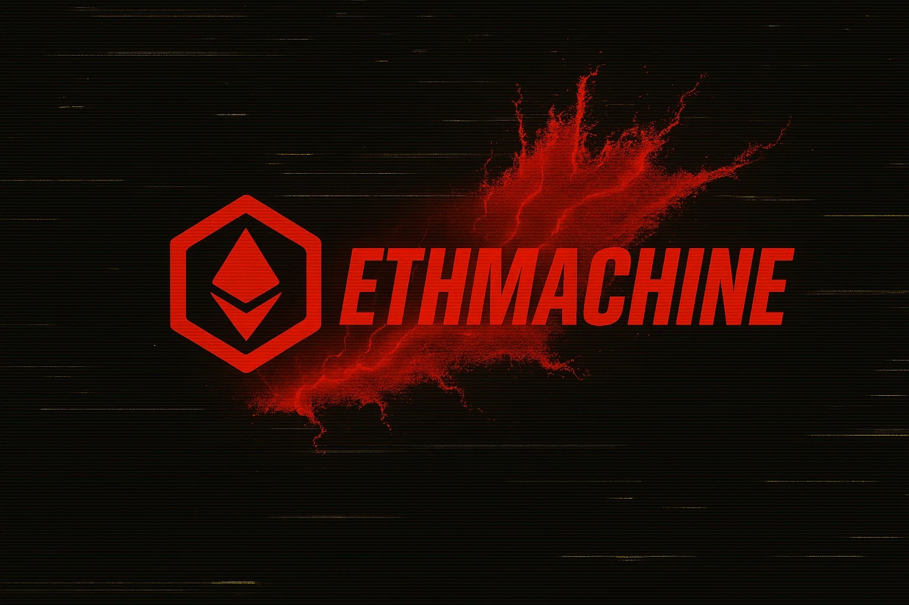
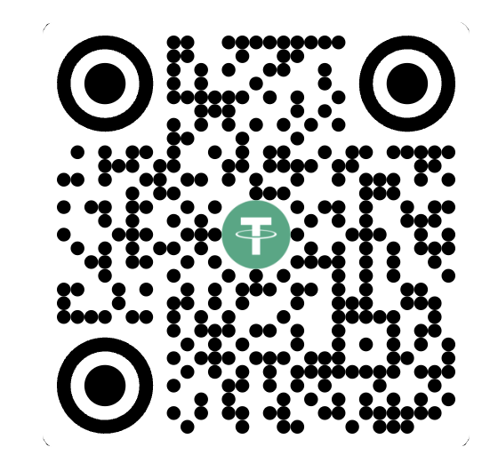

# ETHmachine



Если проект оказался полезен, поддержите разработчика:

**Telegram:** [@DenisHumen](https://t.me/DenisHumen)

Спасибо за поддержку!

```ETH - 0xa24fbbd57720ec580395aedba3ad37f6a6067727```



---

## 📋 О проекте

**ETHmachine** — комплексный инструмент для автоматизации работы с криптовалютными кошельками, биржами, социальными сетями и утилитами для крипто-проектов. Поддерживает 50+ блокчейн-сетей, интеграцию с CEX, Twitter-автоматизацию, генерацию кошельков, управление балансами и многое другое.

## 🚀 Установка

### Требования
- Python 3.10+
- Git

```bash
git clone https://github.com/DenisHumen/ETHmachine
cd ETHmachine
python main.py
```

Зависимости установятся автоматически при первом запуске.

## 📚 Доступные модули

### 💲 Balances
- **ETH Balances** — проверка балансов нативных токенов и ERC20 в EVM-сетях
- **SOL Balances** — проверка балансов SOL и SPL токенов
- **Eclipse Balances** — проверка балансов в сети Eclipse
- **DeBank Checker** — мультичейн проверка всех токенов через DeBank (Playwright + API перехват)
- **DeBank Protocols** — сбор DeFi-позиций: стейкинг, лендинг, locked, LP через DeBank

### 🚀 Transactions
- **Collectors** — сборщик всех балансов с кошельков на main-кошелек (ETH/SOL)
- **Transfer Wallets to Wallets** — перевод нативных токенов между кошельками
- **Transfer ERC20 Tokens** — перевод ERC20 токенов между кошельками
- **Relay Bridge** — мост между сетями через Relay Link с сохранением прогресса в БД

### 🐦 Twitter
- **Twitter Check** — проверка валидности аккаунтов Twitter
- **Twitter Info** — получение детальной информации о Twitter-аккаунтах
- **Twitter Tasks** — автоматическое выполнение заданий (лайки, репосты, комментарии) с БД прогресса

### 📊 Project Stats
- **Neura Statistics** — статистика по проекту Neura

### 🎮 Projects
- **Neura Protocol** — сбор пульсов и клейм задач Neura
- **Pharos Testnet** — faucet, check-in, квесты Pharos

### 🏦 CEX
- **OKX** — вывод, балансы, сбор субаккаунтов, спотовая торговля
- **Binance** — вывод, балансы, сбор субаккаунтов
- **Bitget** — вывод, сбор субаккаунтов
- **MEXC** — вывод средств

### 🧰 Tools
- **Check Gas Price** — проверка текущей цены газа в выбранной сети
- **Generate Wallets** — генерация ETH/SOL кошельков (обычные + vanity-адреса, Rust-ускорение)
- **ETH/SOL Convert Tool** — конвертация мнемоника ↔ приватный ключ ↔ адрес
- **Password Generator** — генерация криптостойких паролей
- **Nickname Generator** — генерация реалистичных никнеймов
- **Fullname Generator** — генерация имён и фамилий (RU/UA/ENG)
- **Check Proxy** — массовая проверка работоспособности прокси
- **Last Transactions** — проверка последних транзакций кошельков
- **Check Age Discord** — проверка возраста Discord-аккаунтов (Win/Mac/Linux)
- **Email IMAP Checker** — валидация почтовых аккаунтов через IMAP

### 💾 Backup
- **Local Backup** — создание/восстановление/ротация локальных бэкапов
- **SFTP Backup** — синхронизация бэкапов на удалённый сервер
- **Live Sync** — автоматическая live-синхронизация с шифрованием

## 🌐 Поддерживаемые блокчейны

**EVM:** Ethereum, Arbitrum, Optimism, Base, Polygon, Avalanche, Fantom, BSC, zkSync Era, Linea, Scroll, Mantle, Blast, Taiko, Mode, Zircuit, Ink, Morph, Alienx, Lumia, Lisk, Metal L2, Sei, XLayer, Unichain, Swellchain, Treasure и другие (50+ сетей с тестнетами)

**Solana:** Solana (Mainnet/Devnet), Eclipse

## 📂 Данные — единый файл `data/data.csv`

Все данные хранятся в **одном CSV файле** `data/data.csv` со следующими заголовками:

```csv
name,private_key,proxy,reserve_proxy,wallet_address,mnemonic,sol_address,sol_private_key,discord_token,email,email_password,email_imap,referral_code,evm_cex_address,sol_cex_address,transfer_amount
```

| Колонка | Описание | Пример |
|---------|----------|--------|
| `private_key` | Приватный ключ EVM кошелька | `0xabc...` или `abc...` |
| `proxy` | Основной прокси | `login:pass@ip:port` |
| `reserve_proxy` | Резервный прокси (fallback) | `login:pass@ip:port` |
| `wallet_address` | ETH-адрес (если без private_key) | `0x742d...` |
| `mnemonic` | Мнемоническая фраза (12/24 слова) | `word1 word2 ... word12` |
| `sol_address` | Solana-адрес | `7xKXt...` |
| `sol_private_key` | Solana приватный ключ | `5J...` (base58) |
| `discord_token` | Discord токен | `MTIx...` |
| `email` | Email адрес | `user@mail.com` |
| `email_password` | Пароль от email | `password123` |
| `email_imap` | IMAP сервер | `imap.mail.com` |
| `referral_code` | Реферальный код | `REF123` |
| `evm_cex_address` | EVM адрес-получатель CEX (для Transfer Wallets / Transfer ERC20 / CEX withdraw) | `0x742d...` |
| `sol_cex_address` | SOL адрес-получатель CEX | `7xKXt...` |
| `transfer_amount` | Сумма для модулей Transfer Wallets / Transfer ERC20. `0.1-0.2` — диапазон сумм; `"0.1-0.2"` или `0.1-0.2%` — процент от баланса; `10-20token` — токены | `0.1-0.2` или `90-100%` |

Не все колонки обязательны — заполняйте только нужные для ваших задач.

### Несколько профилей

Файл данных должен начинаться с `data_` и заканчиваться на `.csv`:
- `data.csv` — основной файл (обратная совместимость)
- `data_main.csv` — основной профиль
- `data_test.csv` — тестовый профиль

Если в `data/` несколько таких файлов — при запуске будет предложен выбор.

### Отдельные файлы

- `data/twitter/` — Twitter аккаунты и задачи (отдельная директория)

## ⚙️ Конфигурация

Основные настройки в `config/`:
- `config.py` — параметры (задержки, потоки, режимы)
- `cex_settings.py` — API ключи бирж
- `rpc.py` — RPC endpoints
- `token_address_erc20.py` — адреса токенов

## 📖 Документация

- [Twitter Tasks](docs/MODULE_TWITTER_TASKS.md) — работа с Twitter и БД прогресса
- [OKX Withdraw](docs/MODULE_OKX_WITHDRAW.md) — настройка вывода с OKX
- [Binance Withdraw](docs/MODULE_BINANCE_WITHDRAW.md) — настройка вывода с Binance
- [Auto Backup](docs/MODULE_AUTO_BACKUP.md) — автоматическое резервное копирование
- [Полный список](docs/README.md)

## 🔒 Безопасность

⚠️ **Важно:**
- Никогда не публикуйте файл `data/data.csv` — он содержит приватные ключи и пароли
- Храните API ключи бирж в безопасности
- Используйте `.gitignore` для исключения конфиденциальных данных
- Регулярно создавайте резервные копии через модуль Backup

## 📊 Логирование

Все операции записываются в папку `log/`:
- Детальные логи операций (full logs)
- Логи ошибок (error logs)
- История выполнения задач

## 🤝 Вклад в проект

Если вы хотите внести свой вклад:
1. Fork репозитория
2. Создайте feature branch (`git checkout -b feature/AmazingFeature`)
3. Commit изменений (`git commit -m 'Add some AmazingFeature'`)
4. Push в branch (`git push origin feature/AmazingFeature`)
5. Создайте Pull Request

## 📄 Лицензия

Проект распространяется под лицензией, указанной в файле [LICENSE.txt](LICENSE.txt).

---

**Разработчик:** [@DenisHumen](https://t.me/DenisHumen)  
**GitHub:** [DenisHumen/ETHmachine](https://github.com/DenisHumen/ETHmachine)
