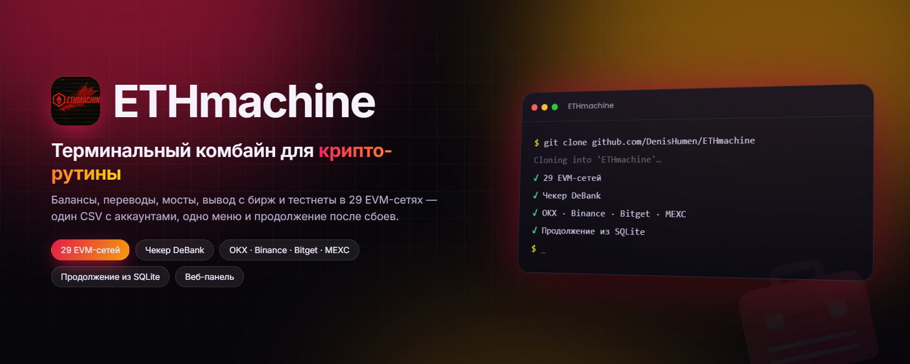

<div align="center">



# ETHmachine

**Терминальный комбайн для крипто-рутины: кошельки, балансы, переводы, биржи, тестнеты — один CSV и одно меню.**

[](#-быстрый-старт)
[](#-быстрый-старт)
[](#-поддерживаемые-сети)
[](LICENSE.txt)
[](https://github.com/DenisHumen/ETHmachine/commits/main)
[](https://t.me/DenisHumen)

[English](README.md) · **Русский**

[Возможности](#-возможности) · [Быстрый старт](#-быстрый-старт) · [Настройка](#%EF%B8%8F-настройка) · [Использование](#-использование) · [Безопасность](#-безопасность)

</div>

---

ETHmachine — консольный инструмент для тех, кто ведёт много кошельков сразу. Один CSV-файл с аккаунтами, одно меню — и оттуда доступны проверка балансов, переводы, вывод с бирж, активности в тестнетах и набор бытовых утилит (генераторы кошельков, паролей, ников, чекеры прокси и почт).

<div align="center">
  
</div>

Ключевые принципы, на которых построен проект:

| | |
|---|---|
| 📄 **Один источник данных** | Все аккаунты — в `data/data.csv`. Модули не читают свои файлы и не просят вводить ключи заново. |
| ♻️ **Возобновляемость** | Долгие операции пишут прогресс в SQLite. Прервали на 300-м кошельке — следующий запуск продолжит с 301-го, а не начнёт заново. |
| 📊 **Отчёты из базы, а не из логов** | Excel-отчёт всегда собирается из БД, поэтому он не врёт после падения. |
| 🧵 **Многопоточность по умолчанию** | Число потоков задаётся один раз в `config/modules/general_config.py` и работает во всех модулях. |
| 🧦 **Прокси на аккаунт** | У каждой строки данных свой прокси и резервный прокси. |

## ✨ Возможности

### 💰 Балансы

| Пункт меню | Что делает |
|---|---|
| **EVM-сети** | Нативный токен в любой из 29 EVM-сетей, а также балансы ERC-20 из `config/token_address_erc20.py` |
| **Solana** / **Eclipse** | Нативные балансы |
| **DeBank Checker** | Все токены во всех сетях сразу (перехват API через браузер). Баланс считается без мусорных аирдропов и сверяется с оценкой DeBank; пороги — в `config/modules/cfg_debank.py` |
| **DeBank Protocols** | DeFi-позиции: стейкинг, лендинг, LP, locked |
| **zkSync Lite** | Чекер балансов на lite.zksync.io с выгрузкой в Excel, а также *Swap to Era* и *DAI Withdraw → L1* |

### 🚀 Транзакции

| Пункт меню | Что делает |
|---|---|
| **Collectors** | Сбор балансов со всех кошельков на главный (`EVM_MAIN_WALLET`) |
| **Перевод нативных токенов** | Между кошельками, суммой или долей от баланса |
| **Перевод ERC-20** | То же для токенов |
| **KAVA → биржа** | Нативный KAVA на CEX через Cosmos SDK (`kava1…` → `0x…`) |
| **Relay Bridge** | Мост между сетями через Relay Link, с прогрессом в БД |

### 🏦 Биржи (CEX)

| Биржа | Вывод | Балансы | Субаккаунты | Спот |
|---|:---:|:---:|:---:|:---:|
| **OKX** | ✅ | ✅ | ✅ | ✅ |
| **Binance** | ✅ | ✅ | ✅ | — |
| **Bitget** | ✅ | — | ✅ | — |
| **MEXC** | ✅ | — | — | — |

Несколько аккаунтов на биржу настраиваются в `config/cex_settings.py` — см. [docs/MULTIPLE_EXCHANGE_ACCOUNTS.md](docs/MULTIPLE_EXCHANGE_ACCOUNTS.md).

### 🎮 Проекты

| Пункт меню | Что делает |
|---|---|
| **Dune Analytics** | Проверка кошельков по дашбордам Dune |
| **Fhenix** | Краны ghostchain и Alchemy (Sepolia) |
| **LiteForge Testnet** | Кран zkLTC, мост, свапы, NFT-минты, домены ZNS |
| **Sahara AI** | Клейм Knowledge Drop и вывод на биржу |
| **SafePal X1** | Проверка права на клейм аппаратного кошелька |
| **xStocks DeFi** | Регистрация, GM, рефералы, поинты *(на паузе)* |
| **Neura** | Статистика по аккаунтам *(только Windows)* |

### 🐦 Twitter

Проверка валидности аккаунтов (**Проверка аккаунтов**) и автоматическое выполнение заданий — лайки, репосты, комментарии (**Выполнение заданий**) — с сохранением прогресса в БД.

### 🧰 Инструменты

| Пункт меню | Что делает |
|---|---|
| **Генерация кошельков** | EVM и Solana, включая «красивые» адреса (Python или Rust) |
| **Конвертер ключей** | Мнемоника ↔ приватный ключ ↔ адрес |
| **Генератор паролей** | Криптостойкие пароли по заданным правилам |
| **Генератор никнеймов** | Правдоподобные ники под регистрации |
| **Генератор имён** | Имена и фамилии: RU / UA / ENG |
| **Проверка прокси** | Доступность, скорость, геолокация, доступ к сервисам |
| **Возраст Discord** | Дата регистрации аккаунтов по токенам |
| **Проверка почт** | Валидация ящиков по IMAP |
| **Загрузка с Pinterest** | Случайные картинки под аватарки |
| **Polygon zkEVM → Base** | Свап всех токенов в USDC через Layerswap |
| **zkSync Era → Base** | Свап USDC/USDT в USDC через Rhino.fi |

### 💾 Бэкапы

Локальные ZIP-архивы с ротацией, выгрузка на SFTP-сервер и live-режим с шифрованием (Fernet + PBKDF2). Подробности — [docs/MODULE_AUTO_BACKUP.md](docs/MODULE_AUTO_BACKUP.md).

### 💻 Веб-панель

Необязательная локальная веб-панель (aiohttp): live-логи, просмотр баз в `db/`, скачивание отчётов, редактирование конфигов из браузера. См. раздел [Веб-панель](#-веб-панель-1).

## 🚀 Быстрый старт

Нужны **Python 3.10+** и **Git**.

```bash
git clone https://github.com/DenisHumen/ETHmachine
cd ETHmachine
python -m venv venv
```

Активация окружения:

```bash
venv\Scripts\activate          # Windows
source venv/bin/activate       # Linux / macOS
```

Установка зависимостей:

```bash
pip install -r requirements.txt
```

Браузерные модули (DeBank, Dune, xStocks, часть тестнетов) требуют Chromium:

```bash
python -m playwright install chromium
```

Запуск:

```bash
python main.py
```

При первом запуске программа создаст каталоги `data/`, `db/`, `result/`, `log/`, `backups/` и шаблоны конфигов. Заполните `data/data.csv` — и можно работать.

> [!TIP]
> **Linux:** для сборки некоторых пакетов нужны заголовки Python и компилятор: `sudo apt install -y python3-dev build-essential`.
>
> **Windows + Python 3.12 и новее:** закреплённый `web3==6.13.0` тянет `lru-dict<1.3.0`, у которого там нет готовых колёс, поэтому pip попытается собрать его из исходников и упадёт без Microsoft C++ Build Tools (см. комментарий в `requirements.txt`). Используйте Python 3.10/3.11 или установите Build Tools.

### Дополнительные зависимости

Нужны только для конкретных модулей — остальное работает без них.

| Модуль | Требуется | Установка |
|---|---|---|
| DeBank, Dune, xStocks | Chromium для Playwright | `python -m playwright install chromium` |
| LiteForge (обход Vercel) | Patchright + Chromium | `pip install patchright && python -m patchright install chromium` (сам пакет уже есть в `requirements.txt`) |
| zkSync Lite → Era | Node.js 18+ | `cd modules/zksync_lite/swap/node_helper && npm install` |
| Красивые адреса (Rust) | Cargo | [rustup.rs](https://rustup.rs) |

## ⚙️ Настройка

### Данные: `data/data.csv`

Все аккаунты живут в одном CSV. Заполняйте только те колонки, которые нужны вашим задачам — остальные можно оставить пустыми.

<details>
<summary><b>Все колонки</b></summary>

| Колонка | Что это | Пример |
|---|---|---|
| `name` | Имя аккаунта для логов | `acc-01` |
| `private_key` | Приватный ключ EVM | `0xabc…` |
| `proxy` | Основной прокси | `user:pass@ip:port` |
| `reserve_proxy` | Запасной прокси | `user:pass@ip:port` |
| `wallet_address` | EVM-адрес, если ключа нет | `0x742d…` |
| `mnemonic` | Мнемоника (12/24 слова) | `word1 word2 …` |
| `sol_address` | Адрес Solana | `7xKXt…` |
| `sol_private_key` | Приватный ключ Solana (base58) | `5J…` |
| `discord_token` | Токен Discord | `MTIx…` |
| `email` | Почта | `user@mail.com` |
| `email_password` | Пароль от почты | `••••` |
| `email_imap` | IMAP-сервер | `imap.mail.com` |
| `referral_code` | Реферальный код | `REF123` |
| `evm_cex_address` | Адрес-получатель EVM (например, депозит биржи) | `0x742d…` |
| `sol_cex_address` | Адрес-получатель Solana | `7xKXt…` |
| `transfer_amount` | Сумма для модулей перевода | `0.1-0.2` или `90-100%` |

</details>

**Формат `transfer_amount`** — два модуля перевода читают его по-разному:

| Значение | Перевод нативных токенов | Перевод ERC-20 |
|---|---|---|
| `0.1-0.2` (с десятичной точкой) | случайная сумма нативной монеты из диапазона | количество токенов |
| `90-100` (целые числа без `%`) | **процент** от баланса | **количество токенов** |
| `90-100%` | процент от баланса | процент от баланса токена |
| `1-3token` | — | фиксированное количество токенов |

Кавычки вокруг значения игнорируются. Подробности для ERC-20 — в шапке `config/modules/cfg_transfer_erc20.py`.

#### Несколько профилей

Файлы данных должны называться `data.csv` или `data_<профиль>.csv`. Если в `data/` их несколько, при запуске программа спросит, с каким работать:

```text
data/data.csv        ← основной
data/data_main.csv
data/data_farm.csv
```

Twitter-аккаунты и задания хранятся отдельно, в `data/twitter/`.

### Настройки: `config/`

Настройки разложены по файлам: общие — в одном месте, специфичные для модуля — рядом с его именем.

```text
config/
├── modules/
│   ├── general_config.py   ← потоки, задержки, ретраи, капча, главные кошельки, включение веб-панели
│   ├── cfg_backup.py       ← локальные бэкапы и SFTP
│   ├── cfg_cex.py          ← правила вывода с бирж
│   ├── cfg_transfer.py     ← переводы нативных токенов
│   ├── cfg_transfer_erc20.py
│   ├── cfg_twitter.py
│   ├── cfg_password.py     ← генератор паролей
│   ├── cfg_generators.py   ← генераторы ников и имён
│   ├── cfg_nice_address.py ← маски «красивых» адресов
│   └── …                   ← по одному файлу на модуль
├── cex_settings.py         ← API-ключи бирж (создаётся при первом запуске, не в git)
├── networks.py             ← RPC-эндпоинты и параметры сетей
├── token_address_erc20.py  ← адреса токенов по сетям
└── menu_config.py          ← состав меню: что показывать, в каком порядке
```

Чаще всего правят `config/modules/general_config.py`:

```python
NUM_THREADS = 5                    # параллельных аккаунтов
SLEEP_BETWEEN_ACTIONS = [2, 4]     # пауза между действиями, сек
DELAY_BETWEEN_ACCOUNTS = [3, 5]    # пауза между стартом аккаунтов, сек
RETRY_COUNT = 15                   # попыток при ошибке (смена прокси/RPC)
SHUFLE_ACCOUNTS = True             # перемешивать аккаунты при запуске
CAPTCHA_SERVICE = 'yescaptcha'     # 2captcha | anticaptcha | capsolver | yescaptcha | capmonster
```

> [!NOTE]
> **Капча:** ключи сервисов пустые по умолчанию — впишите свой в `config/modules/general_config.py`, иначе модули с капчей сообщат, что сервис не настроен.

**Отключить ненужные пункты меню:** в `config/menu_config.py` у любого пункта поставьте `enabled=False` — он исчезнет из меню. Порядок разделов главного меню задаётся списком `MAIN_MENU_ORDER`.

### 🌐 Поддерживаемые сети

**Mainnet (23):** Ethereum, Base, Arbitrum One, Arbitrum Nova, Optimism, Soneium, Polygon, BNB Smart Chain, Sahara AI, Avalanche C-Chain, Core DAO, Kava, Fantom, Gravity Alpha, Zora, Abstract, Somnia, Linea, zkSync Era, Monad, Manta Pacific, ApeChain, Polygon zkEVM.

**Testnet (6):** Sepolia, Pharos, Neura, Nexus, ARC, LiteForge.

**Не-EVM:** Solana, Eclipse.

Свою сеть можно добавить в `config/networks.py` — формат виден по соседним записям. У каждой сети список RPC: при ошибке модули перебирают их по кругу.

## 🧭 Использование

### Что происходит при запуске

`python main.py` выполняет по порядку:

1. **Проверка зависимостей** — при нехватке предложит установить.
2. **Подготовка окружения** — создаёт недостающие каталоги и шаблоны конфигов.
3. **Веб-панель** — если включена (по умолчанию **выключена**), поднимается в фоне.
4. **Проверка обновлений** — сравнивает вашу версию с GitHub. Если согласитесь обновиться, программа отложит ваши правки (`git stash`), выполнит `git pull` и **вернёт правки обратно** (`git stash pop`). При конфликте покажет, какие файлы разошлись.
5. **Бэкап** — автоматическая копия перед началом работы.
6. **Проверка конфигурации** — ищет очевидные ошибки в настройках.
7. **Выбор профиля данных** — если файлов `data_*.csv` несколько.

Дальше открывается главное меню: **Balances**, **Transactions**, **Twitter**, **Projects**, **CEX**, **Tools**, **Backup**, **Info**, **Exit**.

### 💻 Веб-панель

В комплекте есть локальная веб-панель (aiohttp + Jinja2): live-логи, просмотр баз в `db/`, скачивание отчётов, редактирование конфигов из браузера.

**По умолчанию выключена.** Включение — в `config/modules/general_config.py`:

```python
WEB_ENABLED = True
```

Адрес и порт — в `config/modules/cfg_web.py` (по умолчанию `127.0.0.1:8765`). Первый вход открывает `/register` и создаёт root-пользователя.

> [!WARNING]
> **Панель показывает содержимое `data/` и `db/`, то есть ваши приватные ключи.** Не меняйте `WEB_HOST` на `0.0.0.0` — это откроет доступ всей локальной сети без шифрования.

### Обновление

Из меню обновления при запуске — программа сама отложит ваши настройки, подтянет новую версию и вернёт настройки на место. Вручную:

```bash
git pull
pip install -r requirements.txt
```

Формат `data/data.csv`, пути баз в `db/` и имена настроек не меняются между версиями: после обновления ничего перенастраивать не нужно.

## 🔒 Безопасность

- `data/`, `db/`, `result/`, `log/`, `backups/` и `config/cex_settings.py` исключены из git — приватные ключи не уедут в репозиторий случайным `git add`.
- Никогда не публикуйте `data/data.csv` и не выкладывайте бэкапы: в них приватные ключи, мнемоники и пароли.
- API-ключи бирж выдавайте с минимальными правами и белым списком IP.
- Веб-панель держите на `127.0.0.1`.
- Перед крупными операциями делайте бэкап через меню **Backup**.

## 🧱 Стек и архитектура

- Терминальное приложение на **Python 3.10+**; `main.py` только маршрутизирует меню, модули импортируются лениво
- **web3.py 6.13**, `eth-account`, `solders` / `bip-utils` для Solana, `coincurve` для Cosmos-подписи (KAVA)
- **ccxt** и прямые REST-клиенты для OKX, Binance, Bitget и MEXC
- **Playwright** / **Patchright** (Chromium) для браузерных модулей
- **SQLite** для возобновляемого прогресса, **openpyxl** для Excel-отчётов, **loguru** + **tqdm** для логов и прогресс-баров
- **aiohttp** + **Jinja2** для необязательной веб-панели; **paramiko** + **cryptography** для SFTP-бэкапов
- Необязательные генератор красивых адресов на **Rust** и хелпер на **Node.js** для подписи в zkSync Lite

## 📁 Структура проекта

```text
ETHmachine/
├── main.py              ← точка входа, маршрутизация меню
├── config/              ← всё, что правит пользователь
├── modules/
│   ├── ui/              ← общий терминальный UI: меню, панели, ввод
│   ├── data_manager.py  ← единый доступ к data/data.csv
│   ├── proxy_manager.py ← разбор и ротация прокси
│   ├── simple_logger.py ← логи и прогресс-бары
│   ├── eth/  sol/  cex/  twitter/  …
│   └── backup/          ← локальные и SFTP бэкапы
├── web/                 ← веб-панель (aiohttp + jinja2)
├── tests/               ← pytest
├── docs/                ← документация по модулям
├── assets/              ← логотип и картинки
└── data/  db/  result/  log/  backups/     ← создаются при первом запуске
```

## 📚 Документация

- [Полный индекс](docs/README.md) · [Журнал закрытых проектов](docs/closed_projects/README.md)
- [Twitter: задания](docs/MODULE_TWITTER_TASKS.md)
- Вывод: [OKX](docs/MODULE_OKX_WITHDRAW.md) · [Binance](docs/MODULE_BINANCE_WITHDRAW.md) · [Bitget](docs/MODULE_BITGET_WITHDRAW.md) · [MEXC](docs/MODULE_MEXC_WITHDRAW.md)
- [Несколько аккаунтов на бирже](docs/MULTIPLE_EXCHANGE_ACCOUNTS.md)
- [Бэкапы](docs/MODULE_AUTO_BACKUP.md) · [Live-синхронизация](docs/LIVE_BACKUP_QUICKSTART.md)
- [Проверка прокси](docs/MODULE_CHECK_PROXY.md)

## 🤝 Участие

Issues и pull request'ы приветствуются. Окружение для разработки:

```bash
pip install -r requirements-dev.txt
pytest
```

Тесты не ходят в сеть и не трогают пользовательские данные: проверяются импорты всех модулей, целостность меню, соответствие конфигов тому, что импортирует код, вёрстка UI и то, что README упоминает каждый пункт меню. Конвенции для новых модулей — структура модуля, работа с БД, статусы задач, логирование, возобновляемость — в [AGENTS.md](AGENTS.md).

## 💖 Поддержать автора

Если проект оказался полезен:

```text
ERC-20: 0xa24fbbd57720ec580395aedba3ad37f6a6067727
```


## 📄 Лицензия

Распространяется по лицензии [Apache License 2.0](LICENSE.txt).

**Автор:** [@DenisHumen](https://t.me/DenisHumen) · [GitHub](https://github.com/DenisHumen)
